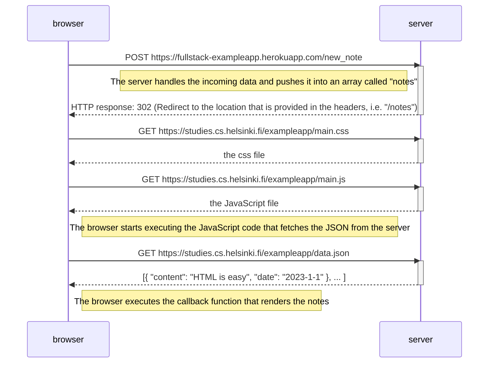

```mermaid
sequenceDiagram
    participant browser
    participant server
    
    browser->>server: POST https://fullstack-exampleapp.herokuapp.com/new_note
    activate server

    Note left of server: The server handles the incoming data and pushes it into an array called "notes"

    server-->>browser: HTTP response: 302 (Redirect to the location that is provided in the headers, i.e. "/notes")
    deactivate server

    
    
    browser->>server: GET https://studies.cs.helsinki.fi/exampleapp/main.css
    activate server
    server-->>browser: the css file
    deactivate server
    
    browser->>server: GET https://studies.cs.helsinki.fi/exampleapp/main.js
    activate server
    server-->>browser: the JavaScript file
    deactivate server
    
    Note right of browser: The browser starts executing the JavaScript code that fetches the JSON from the server
    
    browser->>server: GET https://studies.cs.helsinki.fi/exampleapp/data.json
    activate server
    server-->>browser: [{ "content": "HTML is easy", "date": "2023-1-1" }, ... ]
    deactivate server    

    Note right of browser: The browser executes the callback function that renders the notes 
```
