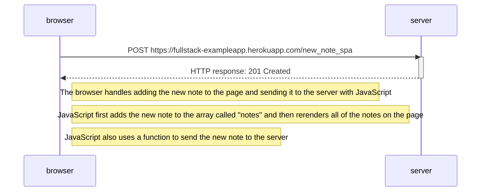

```mermaid
sequenceDiagram
    participant browser
    participant server
    
    browser->>server: POST https://fullstack-exampleapp.herokuapp.com/new_note_spa
    activate server

    server-->>browser: HTTP response: 201 Created
    deactivate server

    Note right of browser: The browser handles adding the new note to the page and sending it to the server with JavaScript
    Note right of browser: JavaScript first adds the new note to the array called "notes" and then rerenders all of the notes on the page
    Note right of browser: JavaScript also uses a function to send the new note to the server
```
